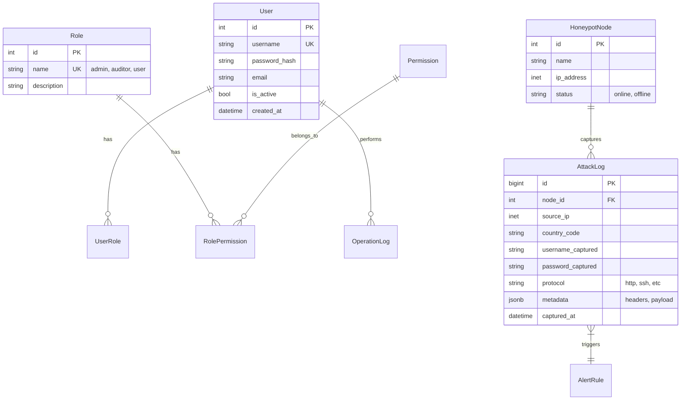

# Data Model & API Documentation (DMA)

## 1. Database Schema (PostgreSQL)

### 1.1 ER Diagram


### 1.2 Tables Definition

#### `users`
| Column | Type | Constraints | Description |
| :--- | :--- | :--- | :--- |
| id | SERIAL | PK | User ID |
| username | VARCHAR(50) | UNIQUE, NOT NULL | Login name |
| password_hash | VARCHAR(255) | NOT NULL | Hashed password |
| role_id | INT | FK -> roles.id | Assigned role |
| created_at | TIMESTAMP | DEFAULT NOW() | Registration time |

#### `attack_logs`
*Partitioned by month for performance.*

| Column | Type | Constraints | Description |
| :--- | :--- | :--- | :--- |
| id | BIGSERIAL | PK | Log ID |
| node_id | INT | FK -> nodes.id | Source Node |
| source_ip | INET | NOT NULL | Attacker IP |
| geo_location | JSONB | NULL | Country, City, Lat/Lon |
| payload | TEXT | NULL | Raw payload or captured creds |
| captured_at | TIMESTAMP | INDEX | Time of attack |

## 2. API Design (RESTful)

### 2.1 Common Standards
- **Base URL**: `/api/v1`
- **Auth Header**: `Authorization: Bearer <token>`
- **Pagination**: `?page=1&page_size=20`
- **Response Format**:
  ```json
  {
    "code": 200,
    "message": "Success",
    "data": { ... }
  }
  ```

### 2.2 Endpoints

#### Auth
- `POST /auth/login`: Exchange credentials for JWT.
- `POST /auth/refresh`: Refresh access token.

#### Users
- `GET /users`: List users (Admin only).
- `POST /users`: Create user.
- `PATCH /users/{id}`: Update user role/status.

#### Honeypot Data
- `GET /attacks/logs`: List attack logs with filters (ip, date range).
- `GET /attacks/stats/trend`: Get time-series data for charts.
- `GET /attacks/stats/geo`: Get geographic distribution.

#### WebSocket
- `WS /ws/attacks/live`: Real-time stream of new attack logs.

## 3. Interfaces

### 3.1 Log Ingestion Interface
Internal interface for the log parser.
- Function: `ingest_log(log_data: LogSchema) -> bool`
- Schema:
  ```python
  class LogSchema(BaseModel):
      timestamp: datetime
      source_ip: str
      raw_data: str
      protocol: str
  ```
