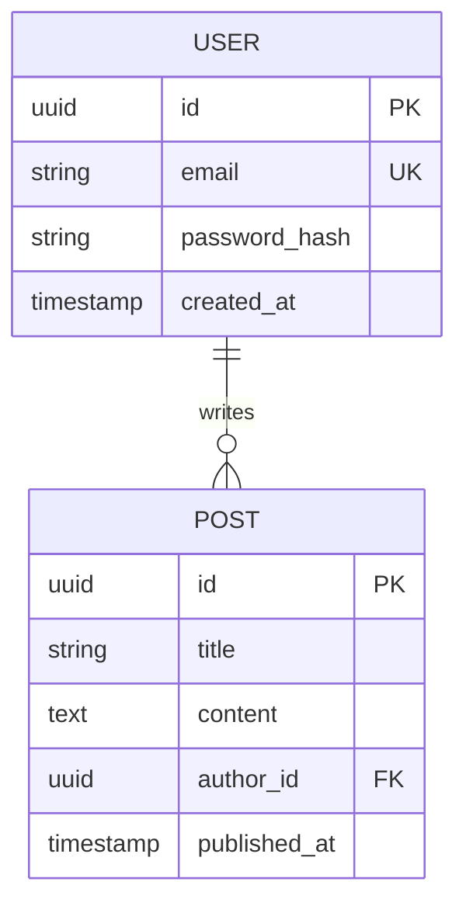

# Data Model & API Documentation (DMA)

> **Template Guide**: Replace all bracketed placeholders with specific data structures and API specifications. Use actual field names and types.

## 0. Model Consistency Check

> [!TIP]
> Ensure all entities here are derived from the System Architecture components in the `TSD.md`.

- **Source Findings**: [findings.md](../findings.md)
- **Architecture Ref**: [TSD.md](TSD.md)

## 1. Data Model

### Entity Relationship Diagram



### Database Schema Details

#### Users Table (`users`)
| Column | Type | Constraints | Description |
|--------|------|-------------|-------------|
| `id` | UUID | PK, NOT NULL | Unique identifier |
| `email` | VARCHAR | UNIQUE, NOT NULL | User login email |

#### [Entity Name] Table
[List columns, types, and constraints]

## 2. API Design

### Base Configuration
- **Base URL**: `https://api.example.com/v1`
- **Auth**: [e.g., Bearer JWT]
- **Rate Limit**: [e.g., 100 req/min]

### Common Response Format

**Success**:
```json
{
  "success": true,
  "data": { ... }
}
```

**Error**:
```json
{
  "success": false,
  "error": { "code": "ERROR_CODE", "message": "Reason" }
}
```

## 3. API Endpoints

### [Resource Name] Endpoints

#### `GET /resource`
- **Purpose**: [List resources]
- **Response**: `200 OK`

#### `POST /resource`
- **Purpose**: [Create resource]
- **Body**: `{ "field": "value" }`
- **Response**: `201 Created`

[Add remaining CRUD endpoints]

## 4. Common Design Patterns (Junior Guide)

### Authentication Pattern
- Use UUIDs for IDs.
- Never store plain-text passwords.
- Include `created_at` and `updated_at` on all tables.

### Relationship Handling
- **1:N**: Put the Foreign Key on the "Many" side.
- **N:N**: Use a junction table (e.g., `user_roles`).

---
## Appendix
- **Migration Scripts**: Reference any SQL migrations in the project root.

| Service | Purpose | Authentication | Endpoints Used |
|---------|---------|----------------|----------------|
| SendGrid | Email delivery | API Key | `/v3/mail/send` |
| Stripe | Payment processing | Secret Key | `/v1/charges`, `/v1/customers` |
| AWS S3 | File storage | IAM Role | S3 SDK |
| Cloudinary | Image processing | API Key + Secret | Upload API |

### Integration Patterns

**Email Service** (SendGrid):
```javascript
POST https://api.sendgrid.com/v3/mail/send
Headers: Authorization: Bearer <api_key>
Body: { from, to, subject, html }
```

**File Upload Flow**:
1. Client requests presigned URL: `POST /api/v1/uploads/presign`
2. Server generates S3 presigned URL: `PUT <presigned_url>`
3. Client uploads directly to S3
4. Client confirms upload: `POST /api/v1/uploads/confirm`
5. Server validates and creates database record

## 9. API Versioning & Deprecation

### Version Migration
- **Current**: v1 (stable)
- **Beta**: v2 (testing)
- **Deprecated**: None currently

### Deprecation Process
1. Announce deprecation 12 months in advance
2. Add `Deprecated: true` header to old version responses
3. Provide migration guide in documentation
4. Maintain old version for 12 months
5. Sunset and remove old version

### Change Log
Maintain a detailed change log for API versions:
- `CHANGELOG_v1.md`
- `CHANGELOG_v2.md`

## 10. API Testing & Documentation

### OpenAPI Specification
Full API specification available at: `/api/v1/openapi.json`

### Interactive Documentation
- **Swagger UI**: `https://api.example.com/docs`
- **Postman Collection**: Available for download

### Testing Environments
- **Sandbox**: `https://sandbox-api.example.com/v1`
  - Test data, fake payments, email logging
  - Separate database, no real side effects
  
- **Production**: `https://api.example.com/v1`

## Appendix

### Data Model Evolution Strategy
- **Additive Changes**: Add new fields/tables without breaking existing clients
- **Migrations**: Use database migration tool (Prisma Migrate/Alembic)
- **Backward Compatibility**: Maintain for at least one major version

### Related Documents
- Product Requirements: [Link to PRD.md]
- Technical Specification: [Link to TSD.md]
- Database Migration Guide: [Link to migrations doc]
- API Client Libraries: [Link to SDK docs]
