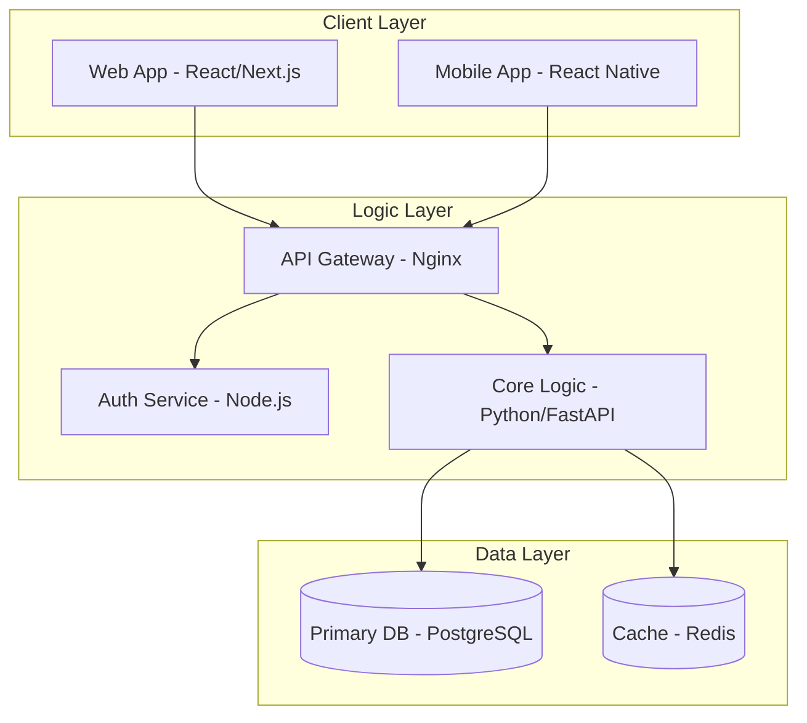

# Technical Specification Document (TSD)

> **Template Guide**: Replace all bracketed placeholders with specific technical details. Cross-reference requirements from the `PRD.md`.

## 0. Requirement Mapping

> [!IMPORTANT]
> Use this section to ensure every technical decision supports a P0/P1 requirement from the PRD.

| Requirement ID | Technical Component | Design Decision |
|----------------|---------------------|-----------------|
| [e.g., PRD-F1] | [Authentication Service] | [Use Auth0 for rapid MVP launch] |
| [e.g., PRD-N1] | [Database Layer] | [Use Postgres with read-replicas for p95 < 200ms] |

## 1. System Architecture

### Architecture Overview
[High-level description of the system's "How". Is it a monolith? Microservices? Serverless?]

### System Architecture Diagram

### Component Breakdown
- **Frontend**: [React 18 / Tailwind / TypeScript]
- **Backend API**: [FastAPI / Node.js 20]
- **Infrastructure**: [AWS EKS / GitHub Actions]

## 2. Technology Stack

### Application Layer
- **Language**: [e.g., TypeScript 5.x / Python 3.11]
- **Framework**: [e.g., Next.js 14 / FastAPI 0.100]
- **API Spec**: OpenAPI 3.0 (Swagger)

### Data Layer
- **Relational DB**: [PostgreSQL 15]
- **Key-Value Store**: [Redis 7.0]

### Infrastructure & DevOps
- **Cloud Provider**: [AWS / GCP / Azure]
- **CI/CD**: [GitHub Actions]
- **IAC**: [Terraform]

## 3. Key Design Decisions

### Decision 1: [e.g., Selecting PostgreSQL over MongoDB]
- **Context**: [Data is highly relational and requires ACID compliance]
- **Rationale**: [Postgres 15 offers robust JSONB support while maintaining relational integrity]
- **Consequences**: [Strict schema management required]

[Add 3-5 critical decisions]

## 4. Security Architecture
- **Auth Strategy**: [e.g., OAuth 2.0 / OIDC]
- **Encryption**: [e.g., TLS 1.3 / AES-256 at rest]
- **Standards**: [e.g., OWASP Top 10 mitigations]

## 5. Scalability & Performance
- **Scaling**: [e.g., Horizontal Auto-scaling via K8s HPA]
- **Targets**: [e.g., p95 Response < 300ms]

## 6. Deployment Architecture
- **Environments**: Dev, Staging, Production
- **Deployment**: [e.g., Blue-Green via ArgoCD]

## 7. Development Guidelines
- **Git Flow**: [e.g., Trunk-based development]
- **Testing**: [e.g., 80% Unit coverage mandatory]

---
## Appendix
- **ADR Log**: See `findings.md` for full Architectural Decision Records.
- **Diagram Source**: Mermaid definitions included in `DOCS/TSD.md`.
